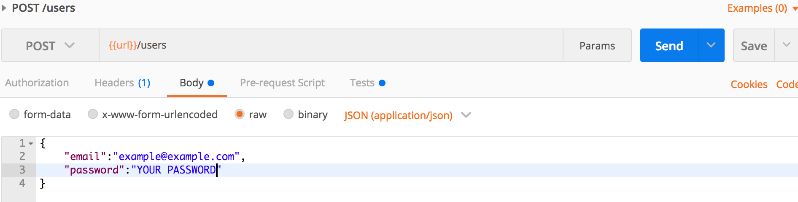
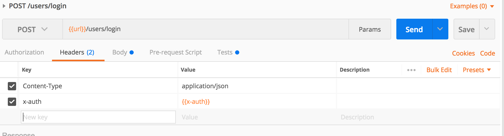
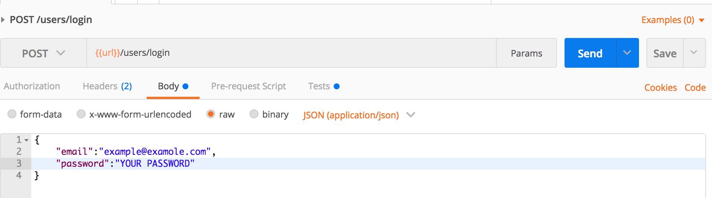
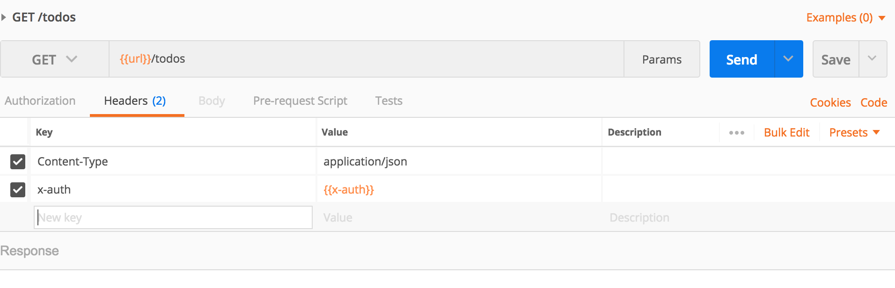
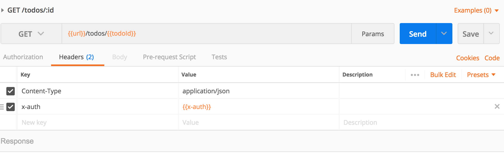
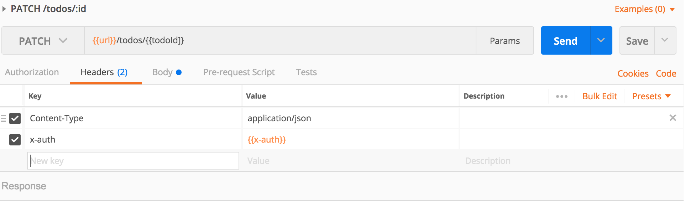
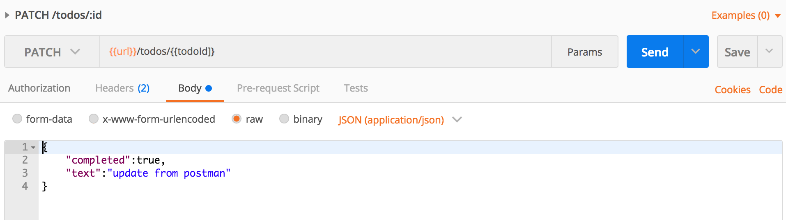
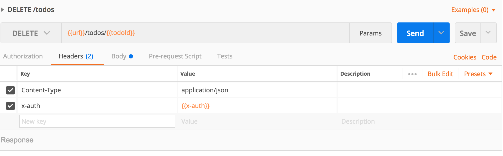

# Rest API 

> The most adopted way to set up yor route.

This is a basic implementation of a ToDo Rest Api, it enable the user authentication, posting todo by specified user, storing everything in a nosql database.

## Components

+ Language: Javascript
+ Database: MongoDB
+ Test: Postman
+ Deployment: Heroku
 

## Install

You can clone this folder and run the below command in the root.

```bash
$ npm install 
```
Then access the api through the below address:

```bash
https://localhost:8080
```


## Usage

Below is a quick example on how to use this api:
> Note: all these should go through Postman, currently i don't have a web interface for the api.

+ **To Sign up as a new user**

+ **To Login as a existing user**


+ **To Get all the Todos**

+ **To Post a Todo**

+  **To Update a Todo**


+ **To Delete a Todo**

